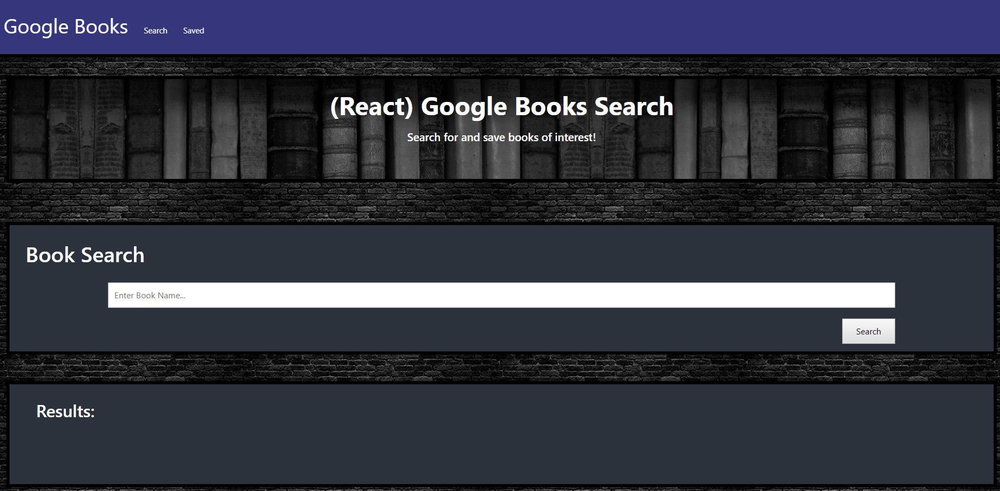

# Google-Books-Search

This app allows the user to search for books (by name) using the google API. The books can then be saved using mongoDb and the saved books can be seen using the Saved tab. This project uses React-Router to navigate between the multiple pages. 

Deployed: https://immense-basin-59334.herokuapp.com/

## Getting Started

You can either use the deployed heroku-app version or download it via git-hub. 

If you download via git-hub, you will have to run npm i to create all the necessary node modules. 

Enter a book name in the search tab and click the "Search" button.

This will bring up a list of books that match the title name.

You will have the option to view the book further on a website or save the book to "your" saved books.

You can view your saved books by clicking the "saved" in the NavBar. 

## Deployment

https://immense-basin-59334.herokuapp.com/

## Built With

* React
* ES6
* Bootstrap
* CSS
* MongoDB
* Mongoose
* Javascript
* Express
* Axios

## Authors

* Dane Shrewsbury

* **Dane Shrewsbury** - 2019
